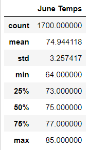
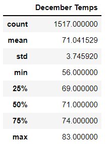

# *Surfs Up Statistical Analysis*

## Overview

The purpose of the analysis is to compare temperature data for the months of June and December in Oahu, in order to determine if the surf and ice cream shop business is sustainable year-round.

## Results

The three major points from the analysis are:
- The difference in mean and in median temperatures for June and December is about 4 degrees.
- The difference in maximum temperatures for each month is 2 degrees.
- The difference in minimum temperatures for each month is 8 degrees.

## Summary 
Since the mean and median temperatures for both June and December are only about 4 degrees different and within the 70 degree range, a surf and ice cream shop business seems sustainable year-round. The 2 degree difference in maximum temperatures, both in the 80 degree range, also supports this assertion.

However, the difference in minimum temperatures should be investigated further, since December's minimum of 56 degrees seems to low for the business model. It would be useful to query for December temperatures with the time of day to determine when the low temperatures occur and if they could harm the business model:

A query for the relative humidity in both months would also be helpful, since the heat index may be a better measure than temperature alone:

