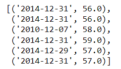

# *Surfs Up Statistical Analysis*

## Overview

The purpose of the analysis is to compare temperature data for the months of June and December in Oahu, in order to determine if the surf and ice cream shop business is sustainable year-round.

## Results

The three major points from the analysis are:
- The difference in mean and in median temperatures for June and December is about 4 degrees.
- The difference in maximum temperatures for each month is 2 degrees.
- The difference in minimum temperatures for each month is 8 degrees.

## Summary 
Since the mean and median temperatures for both June and December are only about 4 degrees different and within the 70 degree range, a surf and ice cream shop business seems sustainable year-round. The 2 degree difference in maximum temperatures, both in the 80 degree range, also supports this assertion.

However, the minimum temperature for December should be investigated further, since frequent low temperatures (less than 60 degrees) may make the business model unsustainable.

Here is the query:

    low_dec_temps = session.query(Measurement.date,Measurement.tobs).filter(extract('month',Measurement.date) == 12).filter(Measurement.tobs < 60).all()   

The query only returns six results, so low temperatures in December do not seem to be frequent enough to challenge the sustainability of the business model:

Only analyzing June and December temperatures may also not provide a large enough dataset for comparison. Also querying for the first quarter of the calendar year (March) and the third quarter (October) may be useful:

    mar_temps = session.query(Measurement.date,Measurement.tobs).filter(extract('month',Measurement.date) == 3).all()
    oct_temps = session.query(Measurement.date,Measurement.tobs).filter(extract('month',Measurement.date) == 9).all()
